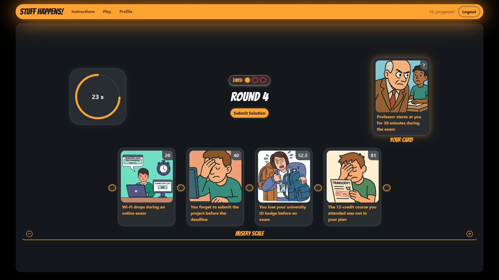
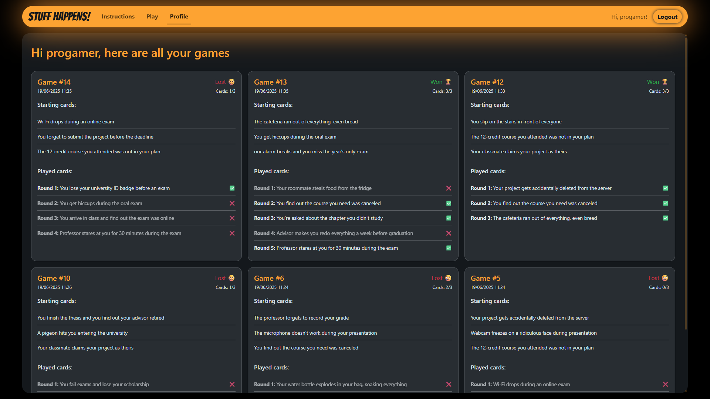

# Exam #1: "Gioco della Sfortuna"
## Student: s343553 SCOLARO ERIK

## React Client Application Routes

- Route `/`: Home page with game instructions and rules. Shows different content based on authentication status (Play Game button for logged users, Try Demo for anonymous users)
- Route `/login`: Login page with authentication form for existing users
- Route `/play`: Game page for authenticated users - full game with 3 lives and game history saving
- Route `/demo`: Demo game page for anonymous users - single round demo without saving
- Route `/profile`: Profile page showing user's game history with statistics and past games

## API Server

### Authentication Routes
- POST `/api/v1/auth/login`
  - request body: `{ username: string, password: string }`
  - response: `{ user: { id, username }, message: string }`
- GET `/api/v1/auth/current`
  - response: `{ authenticated: boolean, user?: { id, username } }`
- DELETE `/api/v1/auth/logout`
  - response: `{ message: string }`

### Game Routes (Authenticated Users)
- GET `/api/v1/users/:userId/games`
  - response: `{ history: [Game objects with complete records and cards] }`
- POST `/api/v1/users/:userId/games/new`
  - response: Basic game object with `livesRemaining: 3`, `roundNum: 0`, `isDemo: false`
- POST `/api/v1/users/:userId/games/:gameId/round/:roundId/begin`
  - response: `{ game: Game object (without records), nextCard: Card object (without miseryIndex) }`
- POST `/api/v1/users/:userId/games/:gameId/round/:roundId/verify`
  - request body: `{ cardsIds: [array of card IDs in user's chosen order] }`
  - response: `{ gameRecord: { card: Card|null, round: number, wasGuessed: boolean }, isEnded: boolean, livesRemaining: number }`

### Demo Routes (Anonymous Users)
- POST `/api/v1/demos/new`
  - response: Basic demo game object with `livesRemaining: 3`, `roundNum: 0`, `isDemo: true`
- POST `/api/v1/demos/:gameId/round/:roundId/begin`
  - response: `{ game: Game object (without records), nextCard: Card object (without miseryIndex) }`
- POST `/api/v1/demos/:gameId/round/:roundId/verify`
  - request body: `{ cardsIds: [array of card IDs in user's chosen order] }`
  - response: `{ gameRecord: { card: Card|null, round: number, wasGuessed: boolean }, isEnded: boolean, livesRemaining: number }`

## Database Tables

- Table `users` - contains user authentication data: id, username, hashed password, salt
- Table `cards` - contains game cards: id, name, description, imageFilename, miseryIndex (1.0-100.0)
- Table `games` - contains game instances: id, userid, createdat, roundnum, isended, isdemo, livesremaining
- Table `game_records` - contains game round records: id, gameid, cardid, round, wasguessed, requestedat, respondedat

## Main React Components

- `App` (in `App.jsx`): Main application component managing user context, error handling, and routing
  - `DefaultLayout` (in `DefaultLayout.jsx`): Layout wrapper with navigation header and alert system
    - `NavHeader` (in `NavHeader.jsx`): Navigation bar with responsive page links and login/logout button

- `GamePage` (in `GamePage.jsx`): Interface for playing both full and demo games
  - `CountdownTimer` (in `CountdownTimer.jsx`): 30s Round timer with visual countdown
  - `LivesIndicator` (in `LivesIndicator.jsx`): Visual display of remaining lives
  - `CardsArea` (in `CardsArea.jsx`): Game board showing player's cards
  - `NewCardArea` (in `NewCardArea.jsx`): Display area for the new card to be played in each round

- `HomePage` (in `HomePage.jsx`): Landing page with game rules and instructions

- `LoginPage` (in `LoginPage.jsx`): Authentication page with form 

- `ProfilePage` (in `ProfilePage.jsx`): User dashboard displaying past games history
  - `GameRecord` (in `GameRecord.jsx`): Individual game history entry

### Shared Components (Used across multiple components)
- `CustomButton` (in `CustomButton.jsx`): Reusable button component for styling purposes
- `CustomSpinner` (in `CustomSpinner.jsx`): Loading indicator component
- `CustomModal` (in `CustomModal.jsx`): Modal dialog component

## Screenshot

## Users Credentials

- progamer, password (User with game history)
- noobplayer, password (User with clean game history)
